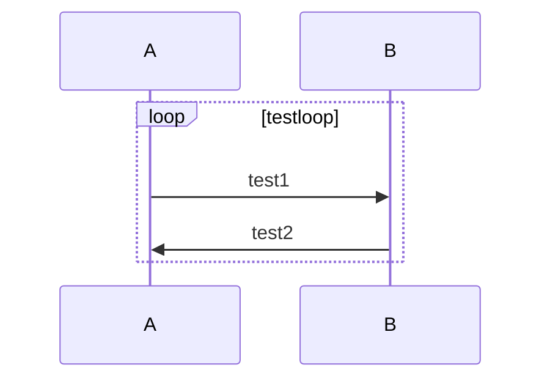
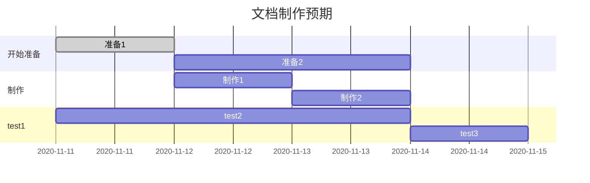
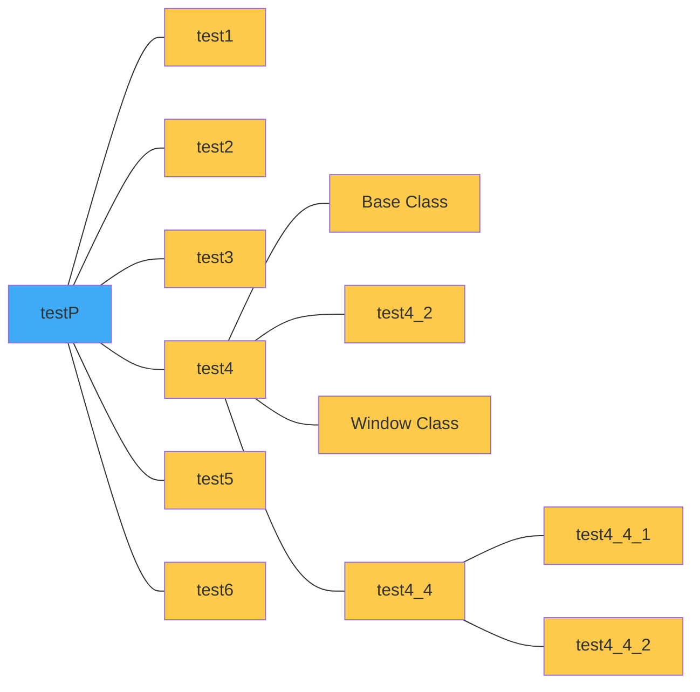

# readmeDemo

## 内容

编写Readme时应该说明以下事项
- 项目名称
    解释项目相关的少量信息
- 动机
    简述创建和维护项目的动机，解释项目存在的意义
- 构建状态
    持续集成的构建状态
- 代码风格
    使用的语言、代码样式，有助于其他人为项目做贡献
- 使用的框架/计数
- 配置开发环境
- 使用说明
    添加逐步的指南
- 代码示例
    为了简洁的显示库的功能，开发人员应该能通过查看代码示例来弄清该项目是如何使用与解决问题的
- API参考
    附加对API简要的使用说明
- 测试
    描述如何使用示例运行测试
- 常见问题说明 
- 贡献 
    用于开源项目，开发人员如何对项目作出贡献
- 版权和信息许可
- License
    MIT, Apache等，如MIT © name
    
## MarkDown
Readme.MD文件使用的语法为 MarkDown语法
MarkDown是一种轻量级的标记语言。

### 语法

1. 标题

   #一级标题

   ##二级标题

   ###三级标题

   ####四级标题

   #####五级标题

   ######六级标题

2. 列表

   `-(或*) 列表1`

   ​	 ` 	-(或*) 列表1.1`

   ​	↓

   - 列表1
     - 1.1

3. 引用

   ` > 引用`

​		↓	

	> 引用

4. 粗体、斜体

   ` *斜体*`

   ​	↓	

   *斜体*

   `**粗体**`

   ​	↓	

   **粗体**

5. 链接与图片

   链接： `[显示本文](连接地址)`

   ​	↓	

   [文本]()

   图片： ``

   ​	↓	

   

6. 分割线

   ```
   内容
   ***
   内容
   ```

   ​	↓	

   内容

   ***

   内容


### 使用
1. 代码高亮
   
   ```
   `test`
   ```
   
    	↓
   
   `test`
   
2. TODO List

   `- [x]已完成`

   ​	↓

   - [x] 已完成

   `- []未完成`

   ​	↓

   - [ ] 未完成

3. 流程图

 ```mermaid
   graph TD
   	A[test1] -->B(test2)
   	B -->C{test3}
   	C -->|a| D[test4]
   	C -->|b| E[test5]
 ```

4. 序列图


5. 甘特图


6. graph RL




6. 表格

| item  | Value      |
| ----- | ---------- |
| test1 | test1value |


## 相关阅读

[在GitHub上编写](https://docs.github.com/en/free-pro-team@latest/github/writing-on-github)